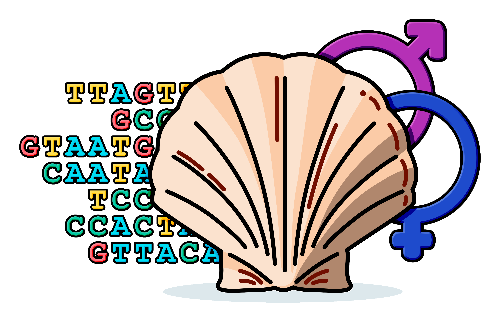

# Final PhD thesis

> **Title**: Integrative perspectives on bivalve sex determination: A comparative and evolutionary analysis across phylogeny.
>
> **PhD program**: Innovative technologies and sustainable use of Mediterranean Sea fishery and biological resources ([FishMed-PhD](https://site.unibo.it/laboratorio-biologia-marina-pesca-fano/en/international-phd-programme))\
> **Cycle**: XXXVII\
> **Final exam**: March 2025
>
> **Supervisor**: prof. Andrea Luchetti
>
> **Settore Consorsuale**: 05/B1 – ZOOLOGIA E ANTROPOLOGIA\
> **Settore Scientifico Disciplinare**: BIO/05 – ZOOLOGIA

In this repository you can find my final PhD thesis, together with the LaTeX code used to generate it, high-resolution figures and a parsable version of tables.

I wish to thank ***all*** the past and present members of the **[EVO·COM](https://sites.google.com/view/evo-com-unibo/home)** group at the University of Bologna. This thesis wouldn't be what it is without the contribution of each of you!

## What you will find here
* <code>[main.pdf](main.pdf)</code> is the final thesis pdf file (which is a little bit huge, so you'll have to download it);
* <code>[main.tex](main.tex)</code> is the main LaTeX thesis document;
* <code>[figures/](figures)</code> is the folder containing high-resolution figures, including [supplementary figures](figures/supp_figures);
* <code>[sections/](sections)</code> is the folder containing the LaTeX documents for each thesis section (frontpage, chapters, etc.);
* <code>[tables/](tables)</code> is the folder contianing the parsable versions of tables, including [supplementary tables](tables/supp_tables).

## Published chapters

<b>Chapter 3</b> – Bivalves as emerging model systems to study the mechanisms and evolution of sex determination: a genomic point of view.

 

>Nicolini F, [Ghiselli F](https://github.com/fghiselli), [Luchetti A](https://github.com/andluche), Milani L. (2023). Bivalves as emerging model systems to study the mechanisms and evolution of sex determination: a genomic point of view. *Genome Biology and Evolution*, evad181. [https://doi.org/10.1093/gbe/evad181](https://doi.org/10.1093/gbe/evad181)
> 
> **Abstract.** Bivalves are a diverse group of molluscs that have recently attained a central role in plenty of biological research fields, thanks to their peculiar life history traits. Here we propose that bivalves should be considered as emerging model systems also in sex-determination studies, since they would allow to investigate: (i) the transition between environmental and genetic sex determination, with respect to different reproductive backgrounds and sexual systems (from species with strict gonochorism to species with various forms of hermaphroditism); (ii) the genomic evolution of sex chromosomes, considering that no heteromorphic sex chromosomes are currently known and that homomorphic sex chromosomes have been identified just in few species of scallops; (iii) the putative role of mitochondria at some level of the sex determination signaling pathway, in a mechanism that may resemble the cytoplasmatic male sterility of plants; (iv) the evolutionary history of sex-determination related gene families with respect to other animal groups. In particular, we think that this last topic may lay the foundations for expanding our understanding of bivalve sex determination, as our current knowledge is quite fragmented and limited to few species. As a matter of fact, tracing the phylogenetic history and diversity of sex-determination related gene families (such as the *Dmrt*, *Sox* and *Fox* genes) would allow to perform more targeted functional experiments and genomic analyses, but also fostering the possibility of establishing a solid comparative framework.
>
> **GitHub**: [filonico/bivalve_sex_perspective](https://github.com/filonico/bivalve_sex_perspective)

<b>Chapter 4</b> – Identification of putative sex-determination related genes in bivalves through comparative molecular evolutionary analyses.

 

> *Manuscript in preparation*.

<b>Chapter 5</b> – Localisation of three sex-related genes and the germline marker <i>Vasa</i>/Vasa in the early developmental stages of <i>Mytilus galloprovincialis.</i>

 

> *Manuscript in preparation*.

